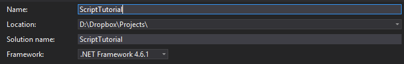
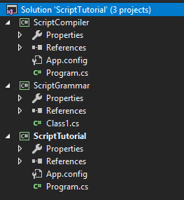
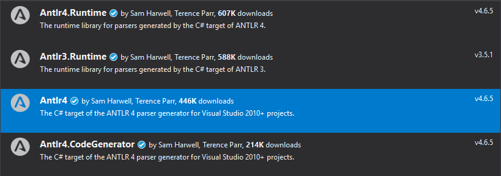
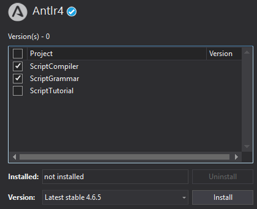
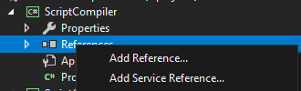
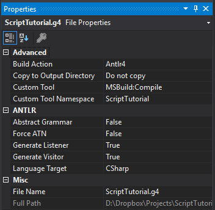
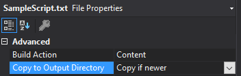

# Building a Scripting Language with Antlr 4 and C#

There's a lot of reasons you might want to build your own script files. For me, it's game development. I need a script format that is easy to use, light on resources to interpret, and importantly, can be interrupted and resumed at any point, and easy to save and restore your current state. It needs to be simple to plug in, and can run without the need to recompile your game. You could even allow users to mod your game in this way.

What we want to do is create our own script file format. We want to take that file and compile it into a binary format that can be easily interpreted by the game. It will be light on features, but it will also be very light on resources. For this task, we will be using c# and Antlr.

## Notice

I hesitate to refer to this as a guide or tutorial, perhaps it would be safer to say this is more of a walkthrough of how I did it rather than an actual tutorial. I don't think it will be useful for everyone, and I gloss over a lot of stuff, possibly important things that you might need to wrap your head around this. There's plenty of resources online you can find for various parts of this process, so be sure to take a look if you don't understand some of the concepts, as I'm pretty poor at explaining them.

## Planning

Before we can get started, we need to know what we're building. As we said earlier, our goal is to make a compiled script format, so we'll need to understand both how our script will look to begin with, and how it will look when it's compiled. Let's take a look.

### Defining a Target

How you create your script is up to you, but for me, I would like a script format that's similar to C or JavaScript. Of course we won't be nearly as advanced as those languages, but on the surface it will look pretty similar.  Here's a bit of a mock-up of what I'd like the script to look like:

```c
main() {
    var i, j;

    j = 0;
    
    for(i = 0; i < 10; i++) {
        OutputText("Hello World!");

        j = 3 * (i + 2);

        if(j == 15)
            OutputText("J is 15 now!");
    }
    OutputText("We're done! The value of j is: ");
    OutputValue(j);
}
```
Definitely looks a lot like C doesn't it.

In order to keep this whole thing from spiraling out of control, we're going to place a number of constraints on our scripting language.

- Everything will exist in he main() function, as we won't be building support for user defined functions. This could be expanded on pretty easily but it would complicate the virtual machine for this example.
- All variables are integers. No floats, strings, or other types.
- Did I say no strings? We will technically support references to strings. We'll store a list of strings in a table, and string references in our code will be replaced by a reference to that string in the table.
- Function calls can be done to external functions within our virtual machine. These will be defined ahead of time, and we'll throw compile errors if the functions used aren't defined.
- We can use basic flow controls, like for and while loops, and perform math operations in the proper order.
- We don't really care much about scoping, as everything will be in main(). 

Straight forward isn't it? Next we need to have an idea of what we'll be compiling into.

### The Assembly Format

In order to execute our script at runtime, we're going to compile our scripts down into an assembly like format. This takes all the ambiguity out of the script, and gives us something very simple to work with. At run time, we will be executing this code within our virtual machine.

Virtual machine in this context isn't anything fancy, it is simply a simulated system where we interpret the code with our own execution pointer, registers and stack.

For our virtual machine, we'll be building something very basic

- Our virtual machine will support only 2 registers, r0 and r1. This should be enough to do everything we need it to do.
- We have a stack to which we can push and pop values.
- We can store and retrieve values from variables, but they must be defined ahead of time.
- All assembly operations will have at most one parameter.
- More complicated operations can be done by combining operators. Calling external functions for example will involve pushing the parameters to the stack, assigning the number of parameters to register r0, and then invoking the external function by id.
- To simplify implementing jumps, our binary format will include a jump table with a script address of all the labels.

That's all pretty straight forward, right? We should also go into detail into all the operators our script format will support. While this is a small list, we should be able to just about everything we'll need with this.

Here's the list of operators we will be supporting:

- Val : Pushes the specified value into register r0.
- Push : Pushes the value of the specified register onto the stack.
- Pop : Pops the most recent value off the stack into the specified register.
- JumpIf : Jumps to the target label if the value of r0 is equal to 0.
- JumpNotIf : Jumps to the target label if the value of r0 is not equal to 0.
- Jump : Jumps to the target label unconditionally.
- Func : Calls an external function by id. Register r0 should contain the number of parameters.
- Assign : Assigns a value to the variable specified.
- GetVar : Gets the value of the specified variable.
- Add / Sub / Div / Mul / And / Or : Performs a math operation between r0 and r1, and places the value in r0.
- Inc / Dec : Increments or decrements the value of r0 by 1.
- Equals / NotEquals : Compares the values of r0 and r1, and places 0 for true and 1 for false in r0.
- GreaterThan / LessThan / GreaterOrEquals / LessThanOrEquals : Compares the value of r0 and r1, and places 0 for true and 1 for false in r0 based on the result.

In addition to the operators, we'll also be using labels. They are not part of the assembly per-se, but are references to a specific location in a script. They're used when you need to jump to specific parts of the script. You could compile them out and specify pointers to specific locations in the script to jump to, but to make it easier we'll simply have a table of all the label locations in our binary format.

### Breaking it Down

Our goal is to compile our sample code we wrote in the above section into our pseudo assembly language. It might be hard to visualize exactly what we'll be doing and how the initial code example will look when compiled down. To solve that, we'll go through the code line by line and explain how we'll transform the code into our assembly.

Lets start with the first line:

```c
var i, j;
j = 0;
```
First off is a variable declaration. This line won't output anything, but it will tell our compiler to expect them.

Then there's an assignment. Since j is the second variable decalred, it will be variable 1 in the output. This statement would be compiled like this:

```assembly
Val 0       ; Sets r0 to 0
Assign 1    ; Assigns value of r0 to variable 1 (j)
```
Easy enough, right? We simply load the value we want into the first register, and then we store that value to the variable.

Next is a big spike in difficulty, the for statement.

```c
for(var i = 0; i < 10; i++) {
```

For statements are fairly complicated. They are made up of three parts, an assignment, a comparison, and an increment, and each one is executed at different times. We'll be outputting a for statement in the following fashion:

- First we simply output the assignment.
- We create a label here, which we will jump back to at the end of the for loop.
- Then we perform the comparison. If the comparison fails, we jump to another label marking the end of the for loop.
- We output the full contents of the for loop.
- We perform our incrementor at this point.
- Then we jump back to the first label.
- Then we output the second label to mark the end of the for loop.

In our assembly language, it will look like this:

```asm
Val 0       ; Sets r0 to 0
Assign 0    ; Assigns value of r0 to variable 0 (i)
:Label0     ; Label defining the start of the if block
Val 10      ; Sets r0 to 10
Push 0      ; Pushes r0 to the stack
Pop 1       ; Pops the last value into r1
GetVar 0    ; Gets the value of i and places it in r0
LessThan    ; Compares r0 and r1 and puts the result in r0
JumpNotIf 1 ; Jumps to label 1 if the comparison is false
```

We're not outputting the increment block or the end of the for blockyet, since that will come when we close our for loop.

Next is our external function call OutputText:

```c
OutputText("Hello World!");
```
As mentioned before, all strings will be converted into numeric references to a string table, so in reality, this function call will look like this at runtime:

```c
OutputText(0);
```
It will be up to the external function to resolve that 0 refers to a string value and fetch the proper value from the lookup table.

While we don't know ahead of time what the id of the function OutputText will be, in our case we'll say OutputText is function 0.

Here's how this will look in our assembly:

```asm
Val 0       ; Sets r0 to 0 (the reference to the first string)
Push 0      ; Pushes r0 to the stack
Val 1       ; Sets r0 to 1 (the number of parameters)
Func 0      ; Calls external function 0 (OutputText)
```

Pretty easy. Next up is our messy math section.

```c
j = 3 * (i + 2);
```

This will compile down to the rather lengthy set of assembly as follows:

```asm
Val 3       ; Sets r0 to 3
Push 0      ; Pushes r0 to the stack
GetVar 0    ; Sets r0 to the value of i
Push 0      ; Pushes r0 to the stack
Pop 1       ; Pops the last value into r1
Val 2       ; Sets r0 to 2
Add         ; Adds r0 and r1 together, places the result in r0
Pop 1       ; Pops the last value into r1 (which will be 3)
Mul         ; Multiplies r0 and r1, places the result in r0
Assign 1    ; Assigns value of r0 to variable 0 (j)
```

While it's long, it's not particularly complicated. You can see we handle the order of operations correctly as well, which is important. While it's a bit tricky to follow, we won't normally have to generate this by hand, so it's fine.

Next is our if statement.

```c
if(j == 15)
    OutputText("J is 15 now!");
```

If statements are somewhat complex, so lets break down how we'll handle an if statement.

- First we perform the comparison.
- If the value is false, we jump to the label representing the else block.
- We perform the true block of the if statement.
- We jump to the end of the if statement.
- We place the else label here.
- We perform the else block.
- We place the end label.

So lets do the assembly for our code. Keep in mind we've already used label 0 and 1 for our for loop, so we'll be using label 2 and 3 for our else block and end block respectively. Although we don't have an else block with this particular if statement, we'll use the same form for all if statements.

```asm
GetVar 1    ; Sets r0 to the value of j
Push 0      ; Pushes r0 to the stack
Pop 1       ; Pops the last stack value into r1
Val 15      ; Sets r0 to 15
Equals      ; Compares r0 and r1, puts the result in r0
JumpNotIf 2 ; Jumps to label 2 if the result is false

;here is the OutputText part
Val 0       ; Sets r0 to 1 (the reference to the second string)
Push 0      ; Pushes r0 to the stack
Val 1       ; Sets r0 to 1 (the number of parameters)
Func 0      ; Calls external function 0 (OutputText)

;back on the if statement
Jump 3      ; Jumps to label 3 (the end of the if statement)
:Label2     ; This label represents the else block
:Label3     ; This label represents the end of the if statement
```

And now onto the end of our for loop.

```c
}
```

This is the point where we need to output the increment part of our for loop and jump back to the start. Then we need to place a label for the end of our for loop. This looks like this:

```asm
GetVar 0    ; Sets r0 to the value of i
Inc         ; Increments r0 by 1
Assign 0    ; Sets i to the value of r0
Jump 0      ; Jumps back to label0, the start of the for loop.
:Label1     ; Label marking the end of the for loop.
```

The last two lines aren't any different from previous function calls, so I won't go over them in detail.

### The Binary Format

Now that we've defined the format we'll be compiling into, we should also give some thought to how we're going to store it.

Luckily for us, we've made some decisions earlier that will make our lives much easier. If you recall, we made the decision early on that all of our operations will be the same size, they're simply an operation id, followed by a single value. We have some additional data we'll need to store, but it's all pretty easy.

So here's how we're going to store our script:

- Our file will have a signature of some kind to identify the file type. We'll simply use the 4 characters, 'SCPT'.
- An integer with the number of operations in it.
- A big list of integers representing our assembly. Nothing fancy, just pairs of integers representing the operation and it's value. The operation id hardly needs to be an integer, but we're going for simplicity and having all the data here be the same type.
- Then we have an integer with the number of strings stored in the file, followed by all the string data.
- Finally an integer with all the labels defined in the script, followed by an array of integers representing the script location of each one.
- Lastly, we will output the number of variables we are storing.

And that's it. Nothing fancy or complicated, just an easy to read and use file.

## What's Next?

At this point, we should have a pretty firm grasp of the language we want to build. We have the whole thing defined, now we just have to go about building it. But how do we go about it? 

There's three major steps that we'll cover:

- Building the grammar - Here we define the syntax of the language we're building using Antlr 4's grammar format. 
- Building the compiler - We will walk the tree that Antlr builds for us and output our compiled binary script.
- Building the interpreter - At this point we take our compiled binary and execute it.

## Setting up the Project

We'll be using Visual Studio 2017 for development. It might be possible to use VS Code, but I'm not familiar with that setup.

First, we'll create a solution for our project, specifying Console App (.NET Framework). I'm using the name ScriptTutorial here. This project will be our environment that we use to load our script.



We'll also need to add two other projects to our solution, one Console App for our compiler which I'll call ScriptCompiler, and a class library (also .NET Framework) for our grammar, which I'll call ScriptGrammar. Your solution should look like this:



Next, we'll need to add Antlr to our project. Open up the Nuget Package Manager (Tools->Nuget Package Manager->Manage Nuget Packages for Solution), and search for Antlr on the browse tab. We're looking for the packages 'Antlr4', 'Antlr4.CodeGenerator', and 'Antlr4.Runtime'.



Make sure you use the Antlr4 packages, not the Antlr3 ones. 

When installing the Antlr packages, you'll only need to specify our Compiler and Grammar projects, as we won't have any dependencies on Antlr to run our compiled scripts.



Lastly, we'll want to make sure our compiler project has a reference to our grammar project. In the ScriptCompiler project, right click the References entry and select Add Reference.



Check the box to add the ScriptGrammar project as a reference, and then hit ok.

Last but not least, we should add the ANTLR Language Support plugin for visual studio. This will give us syntax highlighting for antlr grammar files. You can find the extension on the visual studios extension manager, or get it from the [Visual Studio Marketplace](https://marketplace.visualstudio.com/items?itemName=SamHarwell.ANTLRLanguageSupport).

If you're using the dark visual studio theme, the syntax highlighting won't be very good for you though. In Tools->Options menu, under Environment->Fonts and Colors, you can find the Antlr code highlighting options. I changed Antlr AST Operator and Lexer Rule to the rgb values 78/201/176, and set Parser Rule to rgb values 220/220/220. You can use whatever you want however.

And lastly, since visual studio will throw warnings otherwise, we'll mark our grammar project as CLS compliant. All Antlr generated code will have the CLSComplaint attribute, and visual studio will warn us that it's unnecessary on all antlr generated files if we don't mark our assembly as CLS Compliant as well.

In the Grammar project, under the Properties heading, open AssemblyInfo.cs. Near the bottom, include the following code:

```csharp
[assembly:CLSCompliant(true)]
```

You may also need to add a ```using System;``` reference at the start.

With this, we should be ready to go.

## Creating the Grammar

There's three major parts in building a compiler. The lexer (or lexical analysis) takes our sequence of characters and converts it into a series of tokens. This will take our input string of characters and converts it into individual words or tokens. Once we have a stream of tokens, we can then parse that stream into a syntax tree. From there, we compile or translate the tree into our desired output format.

Lexing and parsing are in my mind the most complicated parts. To simplify the process, we will be using a tool called Antlr. How Antlr works is we provide it with a grammar file, which defines the rules in which the lexer and parser are based, and it will generate the code for us. We can then take the generated code and use it to interpret our script.

That's not to say that Antlr trivializes the task, building a proper grammar is complicated and challenging in it's own right.

### Create the Grammar File

In visual studio, create a new file in the grammar project. Call it whatever you'd like the script language to be called, and give it the .g4 extension for antlr grammar files.

Next, we need to make sure this file is handled properly at compile time. Right click the file in the solution explorer and click properties. In the box that comes up, you should have a dropdown for Build Action. From that list, near the bottom should be an option for Antlr, which you should select. In Custom Tool, put "MSBuild:Compile", and in Custom Tool Namespace, you can put in whatever you'd like your namespace to be for the generated Antlr code.

Your properties should look like this. If the other options don't appear right away, so you might need to click off and re-select the grammar file.



To verify everything is set up correctly, try building your solution. If you receive a compile error complaining that your grammar file is empty, everything should be good to go.


### The Grammar File Layout

Within the Antlr grammar file, we'll be including two distinct types of data,  our lexer rules, and parser rules. To tell them apart, parser rules must be written in all lowercase letters, and conversely lexer rules must start with an uppercase letter (we'll use all uppercase characters). The priority of rules in a file are based on their top down order, rules higher up have a higher priority and will be selected over rules lower down on the list.

Our grammar file will start off with the grammar declaration, which gives our grammar file a name. Then we will include all of the parser rules, and then all our lexer rules. 

We'll start with the following code, which you can put into your grammar file.

```antlr
grammar ScriptTutorial;

/* Parser Rules */

scriptfile : EOF;

/* Lexer Rules */
```

This is the simplest grammar possible that will compile. The first grammar declaration specifies the name of our grammar. Then, under our parser rules, we have a single rule that simply expects an EOF end of file marker. Not a very useful scripting language yet, but we'll work on it.

With this code in place, you should be able to compile and have it succeed with no warnings or errors.

### Writing the Lexer Rules

We will be writing our Lexer/Token rules first, since it hardly makes sense to start with our parser rules. The way we will be writing our lexer rules is bottom up; we will start writing our lowest priority tokens first, which will be placed at the very end of the file, and then we will be moving up to our higher priority ones, which will come before them. If you get them out of order it can cause problems, so be careful to have them in the right spot.

The first token we want is one to capture whitespace. Our language doesn't rely on whitespace, so we'd like to discard any whitespace that we get. Our first rule, at the bottom of our file, will look like this:

```
WHITESPACE : [ \r\t\u000C\n]+ -> skip ;
```

The rule here is made up of three parts. First, the name is in all caps, which identifies it as a token rule. After the colon is a regular expression of things to match. Here we're matching any number of spaces, line breaks, line feeds, tabs, and 0xC, which I guess is a rarely used new page. Then, after the arrow, we're telling antlr to discard this token if encountered. Simple enough.

While we don't need to, we'll also add a rule to catch inline comments. Add this to the file _above_ the previous rule.

```
COMMENT : '//' .+? ('\n'|EOF) -> skip ;
```

This is similar to our whitespace rule. We match the literal '//', then any number of characters in a non greedy search, followed by a newline or end of file. In practice, this should group anything following a // on one line into a single token... and then discards it. Handy right?

Now that we have our discards out of the way, lets start on the tokens we'll actually need to use. Again, we'll add this above our comment and whitespace tokens.

```
DECIMAL : '-'?[0-9]+('.'[0-9]+)? ;
IDENTIFIER : [a-zA-Z_][a-zA-Z_0-9]* ;
```

These two rules will do a lot of our heavy lifting for us. Lets break them down.

The decimal identifier will match any number (which may be preceded by a -) followed by any amount of additional numbers or decimal points. In practice, this should take any numbers in the code and group them into a single token. Note that there's no guarantee this will be a valid number, it could match numbers that say have two decimal points in them. We could use a more complex rule here to catch that, or we can do that on the parsing side of things. For simplicity sake we'll do that over at the parser.

The identifier token here will catch any single word identifiers we'll be using. It matches any letter or underscore followed by any number of letters, numbers, or underscores. This is our variable names, function names, and will even match our reserved keywords (if, for, while, etc) if we don't create higher ranking rules for them.

```
STRING	:  '"' ( '\\"' | ~('"') )* '"' ;
```

Next up is our string literal. It will match an opening quote, then any number of characters that are either escaped quotes or not quotes, and then a closing quote. This should catch any of the strings that we use in our example.

That's pretty much all the complex token rules we have, the rest are all fairly simple.

```
LPAREN : '(' ;
RPAREN : ')' ;

LBRACKET : '{' ;
RBRACKET : '}' ;

LSQUARE : '[' ;
RSQUARE : ']' ;

COMMA : ',';
SEMI : ';';
```

Wouldn't be much of a programming language without these tokens would it? These tokens are quite important for our program flow and should be quite self explanatory.

Now we'll need to take care of all our math operators. There's quite a few of them, but they're easy to understand.

```
AND : '&&' ;
OR  : '||' ;

BOR : '|' ;
BAND : '&' ;

TRUE  : 'true' ;
FALSE : 'false' ;

INC : '++';
DEC : '--';

MULT  : '*' ;
DIV   : '/' ;
PLUS  : '+' ;
MINUS : '-' ;

GT : '>' ;
GE : '>=' ;
LT : '<' ;
LE : '<=' ;
EQ : '==' ;
NE : '!=' ;

EQUALS : '=' ;
```

A whole bunch of them, but nothing unexpected. We might not get around to implementing all of them, and there's more we could include if we wanted, but this will do for us for now.

It's worth pointing out that the ++ operator could be matched by INC or two PLUS tokens. Antlr will chose the INC token if it can because it's higher up in the file. The same is true with out true and false tokens, because it appears higher up in the file than that token, it will chose the first available match for us.

And lastly, we need to define our reserved keywords.

```
IF   : 'if' ;
ELSE : 'else';
VAR  : 'var';
FOR : 'for';
```

It's a pretty short list, but this should be all of our reserved keywords. We should now have everything we need to start writing our parser rules.

### Writing the Parser Rules

The parser rules will be doing the majority of our heavy lifting here. We'll go over in plain text roughly what rules we'll need consists of, and then we'll actually go ahead and create the rules.

#### Top level rule

At the highest level, we have our main function declaration. It consists of an identifier ('main' in this case), an open and close parentheses, and then an open bracket, a block of statements, and then a close bracket.

```
scriptfile : IDENTIFIER LPAREN RPAREN LBRACKET statement* RBRACKET EOF;
```

This will be our top level rule, and does pretty much what it says on the tin. The ```statement*``` here represents any number of statements, which is a rule we haven't yet defined.

#### The statement rule

Unlike our first rule, a statement can be any number of things.

- It can be a variable declaration, which is the var keyword followed by a number of identifiers, separated by commas.
- It can be an if statement, which is the if keyword, an expression in parentheses, a statement block, and optionally, the else keyword also followed by a statement block.
- A for statement, which is similar to the if, but inside the parentheses there's an assignment, comparison, and increment expression separated by simicolons.
- It can be an expression, followed by a semicolon.

A number of those rules use a statement block, so lets define the rule for that first. We define a statement block like such:

```
statementblock : statement                          #SingleStatement
               | LBRACKET statement* RBRACKET       #StatementGroup
               ;
```
The formatting on this one is a bit weird, but this is one of the common layouts for antlr parser rules. The | in the rule is simply an or, and the # symbol is used to identify a rule by name. The naming isn't necessary, but it will help us on the back-end side of things to identify which rule was picked.

Lets break down what this means. Our rule, called statement block, can be represented by either of the following:
- A single statement. This rule is identified by the name SingleStatement.
- It is a left bracket, followed by any number of statements, followed by a right bracket. This rule is identified by the name StatementGroup.

Now lets go back and define what a statement is. Again this is pretty complex, so we'll break it down after.

```
statement : VAR (IDENTIFIER (COMMA IDENTIFIER)*)? SEMI                                                  # VarDeclaration 
          | IF LPAREN expression RPAREN block1=statementblock (ELSE block2=statementblock)?             # IfStatement
          | FOR LPAREN asgn=expression SEMI comp=expression SEMI inc=expression RPAREN statementblock   # ForLoop
          | expression SEMI                                                                             # StatementExpression
          ;
```

Like with the statement block, a statement is a choice between multiple choices. It should be obvious which one antlr will chose given an input syntax, and if it isn't, antlr will throw an error when you attempt to compile your grammar. Here we have 4 separate choices, defined roughly as we explained earlier.

- The first rule is given the name VarDeclaration, and is a var keyword followed by a list of one or more identifiers.
- The second is an if keyword with an expression in parentheses, with a statement block, and optionally an else and another statement block. Here you'll see we use name= syntax here for each statementblock. Since this rule has two statement blocks, we use this to name each one uniquely so we can refer to them individually in code.
- The for statement is the for keyword, with in parentheses three expressions separated by semicolons (named asgn, comp, and inc), followed by a statementblock.
- The last option is simply an expression followed by a semicolon. Note that I've named this StatementExpression, since calling it just Expression would cause a conflict in name with the expression rule.

#### Additional Rules

Three of these four options for the statement rule refer to an expression rule, so we should go ahead and define that. But first, there's a few things we should define first, since we'll be using them in expression.

First, we'll define a parameter list to use in functions.

```
functionparam : expression (COMMA expression)*
              ;
```

This one is simple enough, it is an expression, followed by any number of expressions, separated by commas. For this rule to match there must be at least one parameter, but that's fine as we will make this entire rule optional later. Since there's only really one option to this rule, we don't need to bother giving it a unique name.

Next we will define a list of comparison operators.

```
comparison_operator: GT | GE | LT | LE | EQ | NE;
```

Hard to be simpler than this. A comparison operator can be any one of these tokens, as we defined earlier.

And lastly, we'll define an entity.

```
entity : DECIMAL	#NumericConst
       | STRING		#StringEntity
       | IDENTIFIER	#Variable
       ;
```

As you can see, an entity in this case is either a number, a string, or a variable name. It's probably our most important rule, and ultimately all expressions will end up referencing an entity in some way.

Lets move onto the last rule.

#### The expression rule

This is actually the last antlr rule we will be writing, but it's quite a big one. A lot of antlr's heavy lifting occurs in this rule because it is recursive, which means this rule actually references itself directly. These kinds of rules are called left-recursive rules, and it's probably antlr's strongest point. It will recurse through the rules and pick the highest priority rules automatically based on the order the rules are defined. This will let us define order of operations for our expressions, and have antlr work out the details.

Lets break down what our expression rule will have.

- It can be a unary (increment or decrement) expression.
- An expression can be _any_ math operation, including comparisons and and/or statements. These expressions always have a left and right hand expression.
- It can be a pair of brackets with an expression inside.
- It can be a function call.
- It can be a variable assignment.
- It can simply be an entity.

Our expression rules are defined in this order as well. The highest priority math operations will be first, down to the lowest, followed by the other options. Lets look at the rule.

```
expression : IDENTIFIER type=(INC|DEC)                              #ExpressionUnary
           | left=expression type=(MULT|DIV) right=expression       #MathExpression
           | left=expression type=(PLUS|MINUS) right=expression     #MathExpression
           | left=expression comparison_operator right=expression   #MathExpression
           | left=expression type=(BAND|BOR) right=expression       #MathExpression
           | left=expression type=(AND|OR) right=expression         #MathExpression
           | LPAREN expression RPAREN                               #ArithmeticParens
           | IDENTIFIER LPAREN functionparam? RPAREN                #FunctionCall
           | IDENTIFIER EQUALS expression                           #VarAssignment
           | entity                                                 #ExpressionEntity
           ;
```

What a beast of a rule. Lets break it down.

- At the top, is our highest priority operator, the unary operator. Well sort of, in this case we're only worrying about ++ or -- operations.
- The next two rules are multiplication and division, followed by addition and subtraction.
- Then there are comparison operations. This references our comparison_operator we defined earlier to simplify this rule.
- Then we have our bitwise and and or operations (& and | ). These aren't strictly necessary to compile our example but may as well have them in there.
- Then we have logical and and or operations (&& and ||).
- Next is the an expression in parentheses. You use this in math to define the order of operations. Though this appears at a lower priority on the list, there's no ambiguity on which rule will be picked since it's the only rule starting with the parentheses.
- Then we have our function call. It is defined by an identifier, with an optional list of parameters.
- Next is the variable assignment. This is an identifier, an equals, followed by an expression of it's own.
- And lastly, if it's none of the above, it must be an entity.

It's worth noting that we're using the same name for several of these rules. Since they all share the same signature, we can handle them all with the same function on the backend. There's a number of operations we're missing from the list, so if you ever feel so inclined you can add your own to the list.

And that's the last of the rules! If you've done it right, you should be able to compile the project and have it compile successfully. If you have problems, check out the code and see where you went wrong.

## Writing the Compiler

Now that the grammar is complete, it's time to get to writing actual c# code and building our compiler.

### The Design

Our compiler won't be terribly complicated, but we should make some decisions about how we build it. The way Antlr works is that it will take an input file and parse it into an AST, or an abstract syntax tree. Presuming there's no errors, we can then walk through the tree and all the branches and generate our output code based on what we see. 

With that in mind, we will be splitting things up into the following parts.

- A file with enumerations of all our operations and remote functions.
- A script builder, which will take the requested operations and build the output binary script file.
- A tree walker, that walks the Antlr generated tree and pushes the output to the builder.
- A compiler class that reads the input file, passes it to our Antlr generated parser, creates our builder and tree walker, and executes them in turn.

Once that's done, we'll test our compiler against our initial sample and see how the output looks.

### Creating our Sample Script

For our sample, we're going to use the very same example we had at the very start of this document. If you forgot how that looks, it looks like this:

```c
main() {
    var i, j;

    j = 0;
    
    for(i = 0; i < 10; i++) {
        OutputText("Hello World!");

        j = 3 * (i + 2);

        if(j == 15)
            OutputText("J is 15 now!");
    }
    OutputText("We're done! The value of j is: ");
    OutputValue(j);
}
```

We will add this to our project as SampleScript.txt. In the properties for this file, make sure to specify copy to output directory so it will be available to us when debugging.



### Defining the Operations and Remote Functions

Add a new c# file to our project called ScriptData.cs. This is where we're going to put all of our enumerations. We have two enums we need, one for our remote functions, and one for our operations.

```csharp
public enum RemoteFunction
{
    OutputText,
    OutputValue
}
```

First, the remote functions. This is simple, as our example only has two functions. If we wanted to be more robust, we could create and store data on the number and type of expected parameters and have those verified during compile time, but for now we will take the easy road.

```csharp
public enum Operation
{
    OpVal,
    OpPush,
    OpPop,
    OpJumpIf,
    OpJumpNotIf,
    OpJump,
    OpFunc,
    OpAssign,
    OpGetVar,
    OpAdd,
    OpSub,
    OpDiv,
    OpMul,
    OpAnd,
    OpOr,
    OpInc,
    OpDec,
    OpEquals,
    OpNotEquals,
    OpGreaterThan,
    OpLessThan,
    OpGreaterOrEquals,
    OpLessThanOrEquals,
}
```
Our operation list is certainly longer, but not a lot of surprises. These are just the same list of operations we defined at the start of our project.

### Building the Script Builder

With our enums done, lets get started on our builder class. This class is what our tree walker will interact directly with to output data into our script format. 

First, create a new class and file called ScriptBuilder. Next, we will define some data structures we'll need to hold our script data.

```csharp
private List<string> variableNames = new List<string>();
private List<int> labelLocations = new List<int>();
private List<int> scriptData = new List<int>();
private List<string> stringList = new List<string>();
private List<string> debugOutput = new List<string>();
```
Here we have a number of data structures that will hold the information needed to build our compiled script files. We have a list of our variable names, a list of script locations for our labels, the actual data for our compiled script output, our string data table, and a debug output for our script.

Now lets add functions for interacting with our script builder.

First, and most importantly, we want to define our basic script data functions. The most common thing our builder will be doing is outputting operations to our script data, so lets get that out of the way first.

```csharp
public void OutputOperation(Operation op, int value=0)
{
    scriptData.Add((int)op);
    scriptData.Add(value);

    debugOutput.Add($"{op.ToString().Substring(2)} {value}");
}

private int GetScriptPosition()
{
    return scriptData.Count / 2;
}
```

The OutputOperation function takes an operation name and value, and adds that data onto our scriptData list. We have a default value of 0 for operations that don't take a parameter. For sanity sake, we're also creating a text representation of our operation and adding it to our debug output list.

The GetScriptPosition function does more or less what it says on the tin. A number of functions in the builder will need to know where we are in our script file (particularly when dealing with labels), so it's handy to define a function to do it. We could store a position variable separately, but in this case our position is always just the amount of data in our script data list divided by 2.

Next, variables. We will need to declare new variables, and we'd like to request the id for a given variable name.

```csharp
public void DeclareVariable(string name)
{
    if(variableNames.Contains(name))
        throw new Exception($"Variable of name {name} is already defined.");
    debugOutput.Add($"//var {name} is id {variableNames.Count}");
    variableNames.Add(name);
}

public int GetVariableId(string name)
{
    if(!variableNames.Contains(name))
        throw new Exception($"Variable of name {name} not declared before use.");
    return variableNames.IndexOf(name);
}
```

Nothing too wild and crazy here. We can declare a new variable name, and we can request the id of an existing name. We do some rudimentary error checking as well to output at least somewhat meaningful errors when things go wrong. We also add debug output so we know what ids will be assigned to which variable.

Next is labels. Similar to variables, we need to be able to declare that a label exists, and because we can use a label prior to it's location being defined, we will also need to update a label to mark the current position in the script.

```csharp
public int CreateLabel()
{
    var id = labelLocations.Count;
    labelLocations.Add(0);
    return id;
}

public void SetLabelPosition(int id)
{
    labelLocations[id] = GetScriptPosition();
    debugOutput.Add($":Label{id}");
}

public int CreateLabelAndSet()
{
    var id = CreateLabel();
    SetLabelPosition(id);
    return id;
}
```

Our CreateLabel function will return an id of the next free label, and add a dummy value to our label location list. Later when we're ready to define the location of that label, we can use SetLabelPosition. And just to be nice, CreateLabelAndSet will do both at the same time, if we have need of it.

Next is our string references. This will be just one function.

```csharp
public int AddStringReference(string text)
{
    if (stringList.Contains(text))
        return stringList.IndexOf(text);

    var id = stringList.Count;
    stringList.Add(text);
    return id;
}
```

This should be pretty easy to understand. The first part checks if a string already exists, and if it does, we return a reference to that string's index. Otherwise, we get the next free index, add the text to our list, and return that index.

Lastly, we need to output our script to file. This is slightly more involved than our other functions, but not by a lot.

```csharp
public void OutputScriptFile(string path, bool outputDebugFile)
{
    if (outputDebugFile)
    {
        var outputpath = Path.GetFullPath(path);
        var filename = Path.GetFileNameWithoutExtension(path);
        var debugPath = Path.Combine(outputpath, filename + ".txt");

        File.WriteAllLines(debugPath, debugOutput);
    }

    using (var fs = new FileStream(path, FileMode.Create))
    using (var bw = new BinaryWriter(fs))
    {
        bw.Write("SCPT".ToCharArray()); //file signature

        bw.Write(scriptData.Count/2); //number of operations
        foreach(var i in scriptData)
            bw.Write(i);    //write script data

        bw.Write(stringList.Count); //number of strings
        foreach (var s in stringList)
            bw.Write(s); //write string

        bw.Write(labelLocations.Count); //number of labels
        foreach(var l in labelLocations)
            bw.Write(l); //write label location

        bw.Write(variableNames.Count); //number of variables

        bw.Flush();
        fs.Close();
    }
}
```

This function effectively has two parts. The first part outputs our debug data to file, and the second part writes our script data to file.

The debug part is fairly simple. The general idea is we get the same path as our output file, as well as file name without extension, and output our script to that path with .txt appended to it.

For script data, it is basically just as we described in our script file format section. We first have a file signature, a 4 byte signature with the letters "SCPT". Then we have an int with the number of operations, followed by the script data. We then do the same to output our strings, and then our labels. Lastly, we write the number of variables we are storing. The flush and close are probably unnecessary as we're in a using block, but they're there just to make sure.

### Building the Tree Walker

With our script builder complete, it's time to move on to the meat of our compiler. Create a new file for our class, ScriptTreeWalker.

First, we want to load some namespaces and define a static using to simplify a bunch of our statements later.

```
using ScriptTutorial;
using static ScriptTutorial.ScriptTutorialParser;
```

If you remember early on, we called ScriptTutorial the namespace of our grammar file. ScriptTutorialParser is the name of our grammar with Parser added. We'll be using a lot of both of these.

Next, we'll create a private reference to our builder.

```csharp
private ScriptBuilder builder;
```

Then, we'll define our constructor. We'll need to pass it a reference to our ScriptBuilder, and we'll also need to pass a reference to ScriptTutorialParser.

Now we'll be creating our constructor. At this point, we will start interacting with the generated antlr tree directly. If you recall, our top level rule looked something like this:

```
scriptfile : IDENTIFIER LPAREN RPAREN LBRACKET statement* RBRACKET EOF;
```

The important parts are the identifier, and the list of statements. Our constructor will start with this rule, verify the identifier is what we expect (should always be main), and then loop through the statements and visit those branches on the tree. This looks like this:

```csharp
public ScriptTreeWalker(ScriptBuilder scriptBuilder, ScriptTutorialParser parser)
{
    builder = scriptBuilder;

    var data = parser.scriptfile();
    if(data.IDENTIFIER().GetText() != "main")
        throw new Exception("Top level function is not named main as expected.");

    foreach(var statement in data.statement())
        VisitStatement(statement);
}
```

After we assign a local reference to our script builder, we're pulling a reference directly to our top level rule using parser.scriptfile() (scriptfile being the name of the rule). We then verify the text value of the identifier token matches what we expect. Then, we are looping through each of our statements and calling our visit function for each of them.

Logically, our next step will be to add our visitor for the statement rule. Recall what our statement looks like:

```
statement : VAR (IDENTIFIER (COMMA IDENTIFIER)*)? SEMI                                                  # VarDeclaration 
          | IF LPAREN expression RPAREN block1=statementblock (ELSE block2=statementblock)?             # IfStatement
          | FOR LPAREN asgn=expression SEMI comp=expression SEMI inc=expression RPAREN statementblock   # ForLoop
          | expression SEMI                                                                             # StatementExpression
          ;
```

The visitor function for the statement rule will have to verify which of these rules was selected, and then call the visitor for that rule.

```csharp
public void VisitStatement(StatementContext context)
{
    if (context is VarDeclarationContext varcontext)
        VisitVarDeclaration(varcontext);
    if (context is IfStatementContext ifcontext)
        VisitIfStatement(ifcontext);
    if (context is ForLoopContext forloopcontext)
        VisitForLoop(forloopcontext);
    if (context is StatementExpressionContext expressioncontext)
        VisitExpression(expressioncontext.expression());
}
```

You might see how this is going to work out in the end. We take our statement context, and determine which of the four rules it matches. The names of the contexts here are the ones used in our rule, marked by the # symbol. Once we match a context, we call the visitor for that context.

The only one somewhat different here is our StatementExpressionContext. Since this context contains only an expression with a semicolon, we'll call our VisitExpression using the expression value directly rather than making a visitor just for the StatementExpression.

The var context is a good one to start with here since it is the end of a tree. We will need to loop through all of the identifiers, and then we'll call the DeclareVariable function on our script builder for each one.

```csharp
private void VisitVarDeclaration(VarDeclarationContext context)
{
    var ids = context.IDENTIFIER();

    foreach (var id in ids)
        builder.AddVariableReference(id.GetText());
}
```

All we're doing here is getting a list of all the identifier tokens, and then for each one we're calling our builder. Not too hard.

Next one is our if statement. This one is more complicated, as we'll need to use a series of jumps to make this statement work, so it will require us to both use operations and labels in our output.

Recall our original definition for if statements. We first perform the expression within the parentheses. Then, if it's _false_, we jump to the else block. If it's true, we continue executing into the main block. At the end of the main block, we jump to the end of the if statement. We then mark the label for the start of the else block, output the else block, and mark the ending label.

Now lets put that all together into a function. We'll define our two labels, visit both statement blocks, and output the jumps and update labels as required.

```csharp
public void VisitIfStatement(IfStatementContext context)
{
    var elseLabel = builder.CreateLabel();
    var endLabel = builder.CreateLabel();

    VisitExpression(context.expression());

    builder.OutputOperation(Operation.OpJumpNotIf, elseLabel);

    VisitStatementBlock(context.block1);

    builder.OutputOperation(Operation.OpJump, endLabel);
    builder.SetLabelPosition(elseLabel);

    if(context.block2 != null)
        VisitStatementBlock(context.block2);

    builder.SetLabelPosition(endLabel);
}
```

The code here should be pretty easy to follow, and is pretty much as we broke down earlier. We are now directly outputting operations, but it should be easy to understand. Also since our else block is optional, we do check to verify if it exists before continuing.

Since we use statement blocks in a number of locations, we should create the visitor for that next. Our statement block was defined like this:

```
statementblock : statement                          #SingleStatement
               | LBRACKET statement* RBRACKET       #StatementGroup
               ;
```

As such, we simply need to check which rule was selected, and visit each of the statements.

```csharp
public void VisitStatementBlock(StatementblockContext context)
{
    if(context is SingleStatementContext single)
        VisitStatement(single.statement());
    if (context is StatementGroupContext group)
    {
        foreach(var s in group.statement())
            VisitStatement(s);
    }
}
```

Next, we will be doing our for loop. This is even more involved than the if statement.

What we will do is output the assignment operation first, then output the label defining the start of the loop. Then we perform the comparison, and if false we jump to the end of the loop. We then perform the statement block, then perform the incrementor, and then jump back to the start of the loop.

```csharp
public void VisitForLoop(ForLoopContext context)
{
    VisitExpression(context.asgn);

    var startLabel = builder.CreateLabelAndSet();
    var endLabel = builder.CreateLabel();

    VisitExpression(context.comp);

    builder.OutputOperation(Operation.OpJumpNotIf, endLabel);

    VisitStatementBlock(context.statementblock());

    VisitExpression(context.inc);

    builder.OutputOperation(Operation.OpJump, startLabel);

    builder.SetLabelPosition(endLabel);
}
```

Maybe this wasn't much more involved than the if statement afterall. It's worth noting that unlike c or c++, none of the expressions within the for loop are optional in our language. It would be pretty trivial to update our syntax and check for nulls here though, if you wanted to make that change.

Now we need to handle expressions, which is a real monster. We defined expressions as such:

```
expression : IDENTIFIER type=(INC|DEC)                              #ExpressionUnary
           | left=expression type=(MULT|DIV) right=expression       #MathExpression
           | left=expression type=(PLUS|MINUS) right=expression     #MathExpression
           | left=expression comparison_operator right=expression   #MathExpression
           | left=expression type=(BAND|BOR) right=expression       #MathExpression
           | left=expression type=(AND|OR) right=expression         #MathExpression
           | LPAREN expression RPAREN                               #ArithmeticParens
           | IDENTIFIER LPAREN functionparam? RPAREN                #FunctionCall
           | IDENTIFIER EQUALS expression                           #VarAssignment
           | entity                                                 #ExpressionEntity
           ;
```

While there's a lot of choices here, a number of these are the same type. Like we did with statements, it's just a matter of checking for each context and jumping to the right visitor.

```csharp
public void VisitExpression(ExpressionContext context)
{
    if (context is ExpressionUnaryContext unarycontext)
        VisitUnaryExpression(unarycontext);
    if (context is MathExpressionContext mathcontext)
        VisitMathExpression(mathcontext);
    if (context is ArithmeticParensContext parencontext)
        VisitExpression(parencontext.expression());
    if (context is FunctionCallContext functioncontext)
        VisitFunctionExpression(functioncontext);
    if (context is VarAssignmentContext varcontext)
        VisitVarAssignment(varcontext);
    if (context is ExpressionEntityContext entitycontext)
        VisitEntity(entitycontext.entity());
}
```

Like before, we take some shortcuts here, but otherwise there's nothing special here.

For our unary expression, this is our ++ and -- operators. While we could output operations to get the variable, increment it or decrement it, and then set it again, we have a single operation defined to do this for us. Here's our function.

```csharp
public void VisitUnaryExpression(ExpressionUnaryContext context)
{
    var varid = builder.GetVariableId(context.IDENTIFIER().GetText());

    if (context.type.Text == "++")
        builder.OutputOperation(Operation.OpInc, varid);
    else
        builder.OutputOperation(Operation.OpSub, varid);
}
```

First we get the variable used based on the identifier, and then we simply pick the necessary operation.

Our math expression is probably the most complex visitor we will write in terms of output, so we need to think a bit about how this will work. Each expression will have a left part, a right part, and a operator. In terms of how the virtual machine will handle this, we want the left part to be in the r1 register, and the right part in r0. What makes this complicated is that the left or right part can be an expression of it's own.

To make this work, we first visit the left expression, and then push that result to the stack. This ensures the value will still be available to us after we perform the right expression. After the right expression is done, it's value should still be in the r0 register. We pop the previous value off the stack into r1. We then perform the proper operation for the symbol passed to us.

```csharp
public void VisitMathExpression(MathExpressionContext context)
{
    VisitExpression(context.left);
    builder.OutputOperation(Operation.OpPush, 0);
    VisitExpression(context.right);
    builder.OutputOperation(Operation.OpPop, 1);

    var symbol = "";
    if (context.type != null)
        symbol = context.type.Text;
    if (context.comparison_operator() != null)
        symbol = context.comparison_operator().GetText();

    switch (symbol)
    {
        case "+":
            builder.OutputOperation(Operation.OpAdd);
            break;
        case "-":
            builder.OutputOperation(Operation.OpSub);
            break;
        case "*":
            builder.OutputOperation(Operation.OpMul);
            break;
        case "/":
            builder.OutputOperation(Operation.OpDiv);
            break;
        case "&&":
            builder.OutputOperation(Operation.OpAnd);
            break;
        case "||":
            builder.OutputOperation(Operation.OpOr);
            break;
        case "==":
            builder.OutputOperation(Operation.OpEquals);
            break;
        case "<":
            builder.OutputOperation(Operation.OpLessThan);
            break;
        case ">":
            builder.OutputOperation(Operation.OpGreaterThan);
            break;
        case "<=":
            builder.OutputOperation(Operation.OpLessThanOrEquals);
            break;
        case ">=":
            builder.OutputOperation(Operation.OpGreaterOrEquals);
            break;
        default:
            throw new Exception($"Unhandled math operation {symbol}");
    }
}
```

It's long, but not complicated. We do have a bit at the start there to get the right symbol since it may be in more than one format, but otherwise there's no surprises. After visiting both sides of the expression, we call the proper operation for the symbol used.

Next up is our function call. The way we are handling functions is we push all of the function parameters to the stack, we put the number of parameters into our r0 register, and then we call our function operation with the function id. Here's how that looks in practice.

```csharp
public void VisitFunctionExpression(FunctionCallContext context)
{
    var name = context.IDENTIFIER().GetText();
    if(!Enum.TryParse(name, out RemoteFunction id))
        throw new Exception($"Could not find remote function with the name of {name}");

    var paramcount = 0;

    if (context.functionparam() != null)
    {
        foreach (var e in context.functionparam().expression())
        {
            VisitExpression(e);
            builder.OutputOperation(Operation.OpPush);
            paramcount++;
        }
    }

    builder.OutputOperation(Operation.OpVal, paramcount);
    builder.OutputOperation(Operation.OpFunc, (int)id);
}
```

At the start, we get the text value of our identifier token. Then, we check to see if that value is in our remote function enum. Next, if we have any function parameters, we loop through each parameter, ending with a push and increasing our parameter count. Lastly, we output a val operation with our parameter count, and then call our remote function.

Only two left to go.

Variable assignment is rather easy. On the left side we have our variable name, and on the right side is our expression. We simply need to perform the expression, and then call the assign operation on our variable id.

```csharp
public void VisitVarAssignment(VarAssignmentContext context)
{
    var name = context.IDENTIFIER().GetText();
    var id = builder.GetVariableId(name);

    VisitExpression(context.expression());

    builder.OutputOperation(Operation.OpAssign, id);
}
```

And lastly, and possibly most importantly, is our entity object. Remember the rule: 

```
entity : DECIMAL	#NumericConst
       | STRING		#StringEntity
       | IDENTIFIER	#Variable
       ;
```

An entity can be either a number, a string, or a variable. We'll determine which is which, and handle it within our function.

```csharp
public void VisitEntity(EntityContext context)
{
    if (context is NumericConstContext num)
    {
        if(!int.TryParse(num.GetText(), out var val))
            throw new Exception($"Unable to parse {num.GetText()} as a number.");
        
        builder.OutputOperation(Operation.OpVal, val);
    }

    if (context is StringEntityContext str)
    {
        var text = str.GetText();
        text = text.Substring(1, text.Length - 2).Replace("\\\"", "\"");

        builder.OutputOperation(Operation.OpVal, builder.AddStringReference(text));
    }

    if (context is VariableContext v)
    {
        var name = v.GetText();
        var id = builder.GetVariableId(name);

        builder.OutputOperation(Operation.OpGetVar, id);
    }
}
```

We have three separate handlers for our different types of entities. It might be worth splitting these off into their own handlers. Still, it should be pretty easy to follow. For numeric constants, we simply parse it as an integer, and output it using the val operator. The string entity is much the same, except we go through the trouble of stripping the opening and closing quotes, replacing escaped quotes with real ones, adding it as a string reference before outputting it using the val operator. And lastly, our variable context gets the id for the variable, and then uses the GetVar operator to retrieve the variables value.

### Putting it All Together

With the tree walker done, all that's left is to put the pieces together. Create a new class called ScriptCompiler. We'll be making a static class that we can use to compile our script file.

For this, since it's not long, here's the entire code for the class.

```csharp
static class ScriptCompiler
{
    public static void CompileScript(string inputpath, string outputpath)
    {
        using (var fs = new StreamReader(inputpath))
        {
            var input = new AntlrInputStream(fs);

            var lexer = new ScriptTutorialLexer(input);
            var tokenStream = new CommonTokenStream(lexer);
            var parser = new ScriptTutorialParser(tokenStream);

            var builder = new ScriptBuilder();
            var walker = new ScriptTreeWalker(builder, parser);
            
            builder.OutputScriptFile(outputpath, true);
        }
    }
}
```

A lot of this won't be that different no matter what kind of antlr project you're doing, but lets walk through it. To follow through the code, we start by opening a stream reader for our input text file. We create and AntlrInputStream based on the input stream, and pass it to our Lexer. Next, we take the output of our lexer as a CommonTokenStream and pass it to our generated parser. We then create our builder and tree walker instances, and then output our script file.

Lastly, go to Program.cs and add this guy into our main function:

```csharp
ScriptCompiler.CompileScript("SampleScript.txt", "Output.dat");
Console.WriteLine("Done! Press any key to close.");
Console.ReadKey();
```

Make sure to set our script compiler as the active project and run it. If all goes correctly, it should run without errors. Then browse to the folder it ran in (usually in our project folder \bin\debug if you ran it from visual studio) and check out Output.txt and Output.dat.

Let's take a look at the data we generated, starting with our debug file.


I've labeled the generated code so it is easier to understand what we're looking at. If you go through it, and take a look at our hand generated code we made early on, they should be almost the same. Lets look at some of the notable points.

In particular, it's interesting to see how our math operation turned out, and how the order of operations ended up being handled. You can see it starts with the value 3, pushes it to the stack, and then it resolves the right side of the equasion before doing the multiplication last. This is what we were hoping for, the operations are being handled in the right order. You can play with the expression and see how the different outputs vary, but it should always perform math in the correct order.

We didn't do any debug output for our string assignments, but you can see those are stored in script as integers. The first one uses the value of zero, and the second two use 1 and 2 respectively. If we dig into our string table, we should find that those contain the expected strings.

Lastly, the labels should all be where we'd expect them to. Label 0 appears at the start of our for loop, and we jump back to it when our for loop ends on line 42. Label 1 appears immediately after that on line 43, which we jump to if our for comparison on line 13 fails. Our if statement similarly appears to have been constructed correctly.

Now lets take a look at the binary data. You can open this file up in your favorite text editor.


I've highlighted each section so you can easily see the data it represents. If you use our Operation enum as a reference, you can probably even piece together the script data yourself. You can see that our script has 0x2D entries (45 in decimal) which makes it 90 bytes in length, and there are 3 strings, 4 labels, and 2 variables. Everything appears to be in order.

## Making the Virtual Machine

We've come a long way, all that's left is to interpret our compiled script. Thankfully, this is probably the easiest part of what we're doing here.

Before we start, we should either copy our ScriptData enums to the new project, or add the compiler as a reference to our main project. We don't actually need references to antlr or our compiler at all, but we do need those enums to make sense of our script data.

### The Virtual Machine

Switch the active project over to our ScriptTutorial project (our initial project), and create a new class called ScriptVirtualMachine. First, we'll define our script data.

```csharp
private List<int> scriptData = new List<int>();
private List<int> labelLocations = new List<int>();
private List<string> stringData = new List<string>();
```

Next, we'll define the actual virtual machine components itself. Luckily there's not much to this.

```csharp
private int[] r = new int[2];
private int position;
private Stack<int> stack = new Stack<int>();
private int[] variables;
```
This is all the information we'll need to get things working. We have our two registers, an execution pointer, our stack, and our variable list. It seems small, but there's nothing else we'll need to execute our script files. We don't initialize our variables object yet since we won't know how many we need until we load the script.

Now we'll load our binary script data in the constructor of our class. We'll load all the data into their respective objects, and initialize everything to it's starting values.

```csharp
public ScriptVirtualMachine(string path)
{
    using (var fs = new FileStream(path, FileMode.Open))
    using (var br = new BinaryReader(fs))
    {
        var sig = br.ReadChars(4);
        if(new string(sig) != "SCPT")
            throw new Exception("File is not a valid script file!");

        var datalen = br.ReadInt32();
        for (var i = 0; i < datalen * 2; i++)
            scriptData.Add(br.ReadInt32());

        var stringlen = br.ReadInt32();
        for(var i = 0; i < stringlen; i++)
            stringData.Add(br.ReadString());

        var labellen = br.ReadInt32();
        for(var i = 0; i < labellen; i++)
            labelLocations.Add(br.ReadInt32());

        var varcount = br.ReadInt32();
        variables = new int[varcount];
    }
}
```

We're more or less doing the opposite of what we did when we saved our script data to file. We verify the signature is correct, load our script data (making sure that we load twice the specified length since our operations are two integers in size), then our string data and label data. Lastly we allocate an array to store all of our variable data in.

Now we have to process the operations we receive. This is a long function, but it's pretty straight forward as well.

```csharp
private void Advance()
{
    var op = (Operation)scriptData[position * 2];
    var val = scriptData[position * 2 + 1];
    position++;

    switch (op)
    {
        case Operation.OpVal:
            r[0] = val;
            break;
        case Operation.OpPush:
            stack.Push(r[val]);
            break;
        case Operation.OpPop:
            r[val] = stack.Pop();
            break;
        case Operation.OpJumpIf:
            if (r[0] == 0)
                position = labelLocations[val];
            break;
        case Operation.OpJumpNotIf:
            if (r[0] != 0)
                position = labelLocations[val];
            break;
        case Operation.OpJump:
            position = labelLocations[val];
            break;
        case Operation.OpFunc:
            r[0] = RemoteFunctionCall(val);
            break;
        case Operation.OpAssign:
            variables[val] = r[0];
            break;
        case Operation.OpGetVar:
            r[0] = variables[val];
            break;
        case Operation.OpAdd:
            r[0] = r[1] + r[0];
            break;
        case Operation.OpSub:
            r[0] = r[1] - r[0];
            break;
        case Operation.OpMul:
            r[0] = r[1] * r[0];
            break;
        case Operation.OpDiv:
            r[0] = r[1] / r[0];
            break;
        case Operation.OpAnd:
            r[0] = (r[1] == 0 && r[0] == 0) ? 0 : 1;
            break;
        case Operation.OpOr:
            r[0] = (r[1] == 0 || r[1] == 0) ? 0 : 1;
            break;
        case Operation.OpInc:
            variables[val]++;
            break;
        case Operation.OpDec:
            variables[val]--;
            break;
        case Operation.OpEquals:
            r[0] = (r[1] == r[0]) ? 0 : 1;
            break;
        case Operation.OpNotEquals:
            r[0] = (r[1] != r[0]) ? 0 : 1;
            break;
        case Operation.OpGreaterThan:
            r[0] = (r[1] > r[0]) ? 0 : 1;
            break;
        case Operation.OpLessThan:
            r[0] = (r[1] < r[0]) ? 0 : 1;
            break;
        case Operation.OpGreaterOrEquals:
            r[0] = (r[1] >= r[0]) ? 0 : 1;
            break;
        case Operation.OpLessThanOrEquals:
            r[0] = (r[1] <= r[0]) ? 0 : 1;
            break;
        default:
            throw new Exception($"Unknown operation {op}!");
    }
}
```

First we open by loading the operation and value of the current command, and then advance the script position by one. Then, we simply switch on the operation value and perform the required action.

All of the actions we're doing here should be pretty simple. We split out our remote function handling into it's own class. Our comparison operations are pretty messy, but are only really that way because we need to convert the resulting true/false into 0/1. And lastly, if we for some reason get an unknown operation id, we throw an exception.

Next lets do our remote function handler. We only have two remote functions so we'll handle both in the same function.

```csharp
private int RemoteFunctionCall(int id)
{
    var function = (RemoteFunction)id;

    var parameters = new int[r[0]];
    for (var i = parameters.Length - 1; i >= 0; i--)
        parameters[i] = stack.Pop();

    if (function == RemoteFunction.OutputText)
    {
        var text = stringData[parameters[0]];
        Console.WriteLine(text);
        return 0;
    }

    if (function == RemoteFunction.OutputValue)
    {
        Console.WriteLine(parameters[0]);
        return 0;
    }

    throw new Exception($"Unhandled function id {id}.");
}
```

First, we convert the given id into our remote function list. Then, we create an array of parameters based on the value of register r0, and then we loop through poping entries off the stack in remote order. This is because our first parameter will inevitably be the deepest on the stack.

Then, we check to see which remote function we're using. If we had a lot of remote functions maybe we could use reflection or other advanced methods to generate a list of remote function handlers, but since we only have two, this will do.

For our output text function, we simply lookup the string data based on the first parameter and output that to the console. For output value, we output the parameter value directly. Because functions can be used in parts of math operations and such, we need to make sure it returns a value, here we simply return 0.

Lastly, we simply need to loop advancing our script until we reach the end.

```csharp
public void Execute()
{
    while (position < scriptData.Count / 2)
        Advance();
}
```

As simple as can be. Simply loop until our position goes past the end, and we're done.

All we need to do is execute our script. Open up our Program.cs and put in the following code:

```csharp
var vm = new ScriptVirtualMachine(@"..\..\..\ScriptCompiler\bin\Debug\Output.dat");
vm.Execute();

Console.WriteLine("Done executing!");
Console.ReadKey();
```

All we're doing is specifying the location of our compiled script and executing it. We then wait for a key input so the output window stays open long enough to read it.

Give it a spin, if we've done everything correct, we should see the following output:


And that's it! Our script executes exactly as we hoped for. With this, we have a fully working compiler and virtual machine interpreter.

## Ideas for expansion

In my introduction, I said that I needed a script format that I could easily serialize and deserialize, and yield and interrupt execution. Our script format doesn't do any of this... but it could without a lot of work. There's no reason our script needs to execute to the very end before returning, and it would be almost trivial to store and restore our vm state.

As mentioned earlier, remote function handling could be done way better. Rather than using an enum, we could use reflection to find remote functions by name, or we could generate our enum automatically in code ourselves.

# Thanks for Reading!